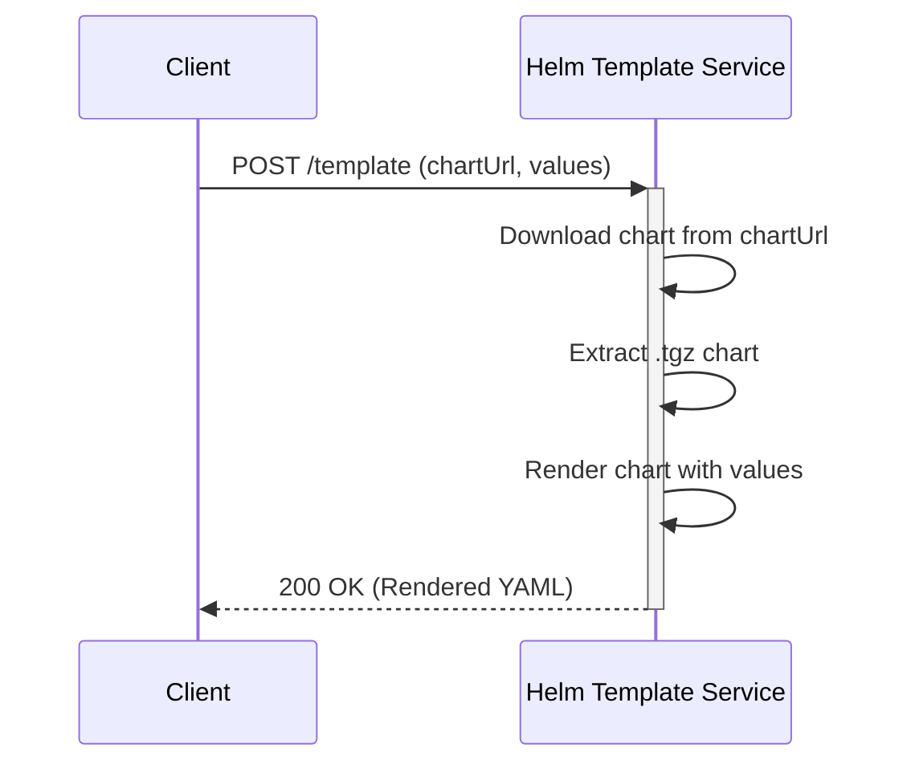

# Design Document: Helm Template Service

## 1. Introduction

This document outlines the design and architecture of the Helm Template Service. This service provides a web-based API to render Helm charts without requiring the client to have Helm installed locally. It is a stateless service that, given a URL to a Helm chart and a set of values, returns the rendered Kubernetes manifests.

## 2. Service Architecture

The service is a single Go application that exposes an HTTP server. It is designed to be lightweight and easily deployable as a container.

### Core Components:

*   **HTTP Server**: Listens for incoming requests on port 8080.
*   **`/template` Endpoint Handler**: Contains the core logic for processing requests.
*   **Chart Downloader**: Fetches Helm charts from a given URL.
*   **Chart Extractor**: Unpacks the downloaded `.tgz` chart file.
*   **Helm Templating Engine**: Uses the `go-helm-template` library to render the chart.

## 3. API Endpoint: `/template`

This is the sole endpoint provided by the service.

*   **Methods**: `GET`, `POST`
*   **Content-Type**: `application/json` for `POST`, query parameters for `GET`.

### Request Payload (`POST`):

```json
{
  "chartUrl": "https://example.com/path/to/chart.tgz",
  "values": {
    "replicaCount": 3,
    "image": {
      "repository": "nginx",
      "tag": "stable"
    }
  }
}
```

### Request Parameters (`GET`):

*   `chartUrl`: (Required) The URL to the `.tgz` Helm chart.
*   `values`: (Optional) A JSON string of the values to override.

### Success Response:

*   **Status Code**: `200 OK`
*   **Content-Type**: `text/plain; charset=utf-8`
*   **Body**: The rendered Kubernetes YAML manifests as a single string.

### Error Responses:

*   `400 Bad Request`: Invalid JSON, missing `chartUrl`, or invalid `values` format.
*   `405 Method Not Allowed`: If a method other than `GET` or `POST` is used.
*   `500 Internal Server Error`: If there's an issue downloading, extracting, or templating the chart.

## 4. Workflow

1.  A client sends a request to the `/template` endpoint.
2.  The service parses the `chartUrl` and `values` from the request.
3.  The chart is downloaded from the `chartUrl` to a temporary directory.
4.  The `.tgz` file is extracted into another temporary directory.
5.  The service identifies the root directory of the extracted chart.
6.  The `go-helm-template` library loads the chart from the filesystem.
7.  The chart is rendered with the provided `values`.
8.  The resulting YAML string is written to the HTTP response.
9.  The temporary directories are cleaned up.

## 5. Example Usage

Here is an example of how to use the service with `curl`:

```bash
curl -X POST http://localhost:8080/template \
-H "Content-Type: application/json" \
-d '{
  "chartUrl": "https://charts.bitnami.com/bitnami/apache-8.9.1.tgz",
  "values": {
    "replicaCount": 2
  }
}'
```


## 6. Sequence Diagram


